# FatakNews.in — Complete PHP + MySQL News Platform

## 🚀 Project Structure
```
fataknews/
├── .htaccess                    # Apache URL routing & security
├── config/
│   ├── config.php               # App configuration (DB, paths, etc.)
│   └── Database.php             # PDO singleton database class
├── includes/
│   └── bootstrap.php            # App bootstrapper (loads everything)
├── app/
│   ├── helpers/
│   │   ├── Auth.php             # Login/logout/role checks
│   │   ├── Csrf.php             # CSRF protection
│   │   ├── Helper.php           # Utility functions (slug, timeAgo, etc.)
│   │   └── Upload.php           # Image upload + resize
│   ├── models/
│   │   ├── Model.php            # Base model (CRUD)
│   │   ├── UserModel.php        # Users, follow system
│   │   ├── PostModel.php        # News/posts, reactions, bookmarks
│   │   ├── CategoryModel.php    # Category tree (3 levels)
│   │   ├── CommentModel.php     # Threaded comments
│   │   ├── NotificationModel.php
│   │   └── HrModel.php          # HR: employees, leaves, attendance, payroll
│   └── views/
│       ├── layouts/
│       │   ├── header.php       # Navbar, ticker, mega menu
│       │   └── footer.php       # Footer, scripts
│       └── pages/
│           ├── home.php         # Home: hero slider, feed, sidebar
│           ├── login.php        # Login page
│           └── register.php     # Register page
├── panels/
│   ├── admin/
│   │   └── dashboard.php        # Admin dashboard (stats, charts, post mgmt)
│   ├── manager/
│   │   └── dashboard.php        # Manager dashboard (approve/reject queue)
│   ├── employee/
│   │   ├── dashboard.php        # Employee dashboard (my posts, attendance)
│   │   └── create_post.php      # Rich text editor + post creator
│   └── hr/
│       └── dashboard.php        # HR dashboard (attendance, leaves, dept stats)
├── api/
│   ├── auth.php                 # Login/Register
│   ├── posts.php                # Create/react/bookmark posts
│   ├── comments.php             # Add comments
│   ├── follow.php               # Follow/unfollow users
│   ├── notifications.php        # Get/read notifications
│   ├── admin/
│   │   └── posts.php            # Approve/reject/delete posts
│   └── hr/
│       ├── leaves.php           # Apply/approve leaves
│       └── attendance.php       # Mark attendance
├── database/
│   └── schema.sql               # Complete DB schema (16 tables)
└── public/
    ├── index.php                # Front controller / router
    ├── uploads/
    │   ├── thumbnails/          # Post thumbnails
    │   ├── avatars/             # User avatars
    │   └── news/                # News images
    └── assets/
        ├── css/
        │   └── app.css          # Full stylesheet (dark, social-media style)
        └── js/
            └── app.js           # All interactions (react, follow, search, etc.)
```

---

## ⚙️ Installation

### Requirements
- PHP 8.1+
- MySQL 8.0+
- Apache with `mod_rewrite` enabled
- GD extension (for image resizing)

### Step 1 — Database Setup
```bash
mysql -u root -p < database/schema.sql
```

### Step 2 — Configuration
Edit `config/config.php`:
```php
define('APP_URL',  'https://fataknews.in');   // Your domain
define('DB_HOST',  'localhost');
define('DB_NAME',  'fataknews_db');
define('DB_USER',  'your_db_user');
define('DB_PASS',  'your_db_password');
define('GOOGLE_CLIENT_ID', 'your-google-client-id.apps.googleusercontent.com');
define('GOOGLE_CLIENT_SECRET', 'your-google-client-secret');
```

## Screenshots

### Desktop Mode

| Home Featured | Home Latest |
| --- | --- |
| 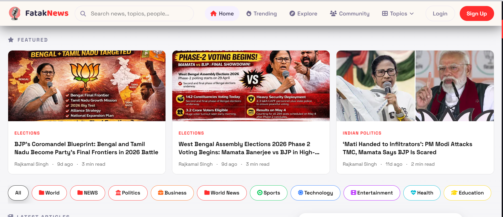 |  |

| Hero Story | Trending |
| --- | --- |
|  | 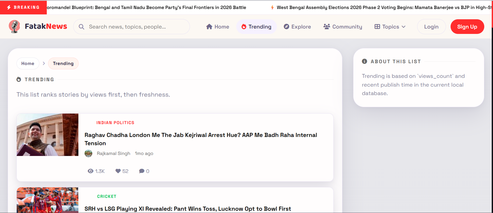 |

| Explore | Community |
| --- | --- |
| 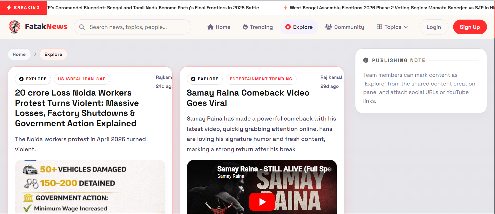 | 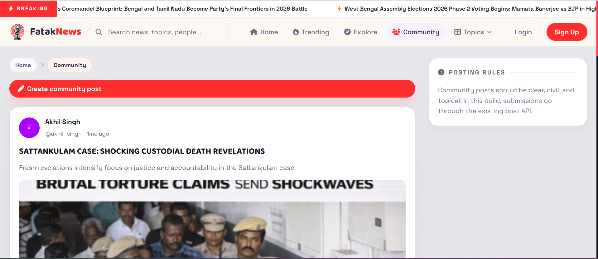 |

| Admin Dashboard | Employee Dashboard |
| --- | --- |
| 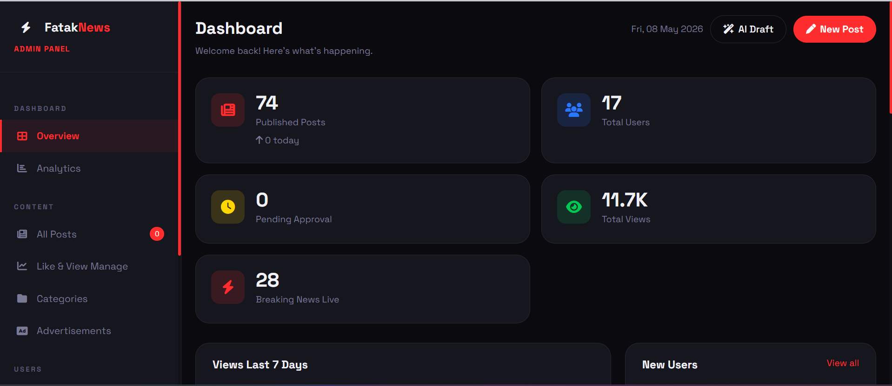 | 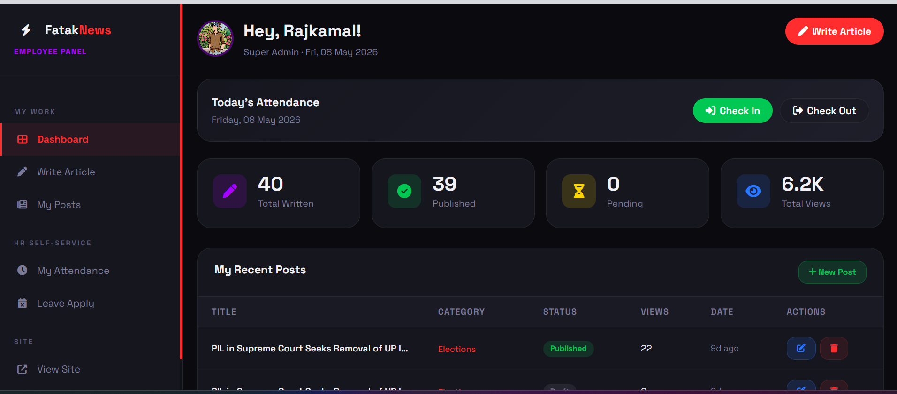 |

| Manager Dashboard | HR Dashboard |
| --- | --- |
| 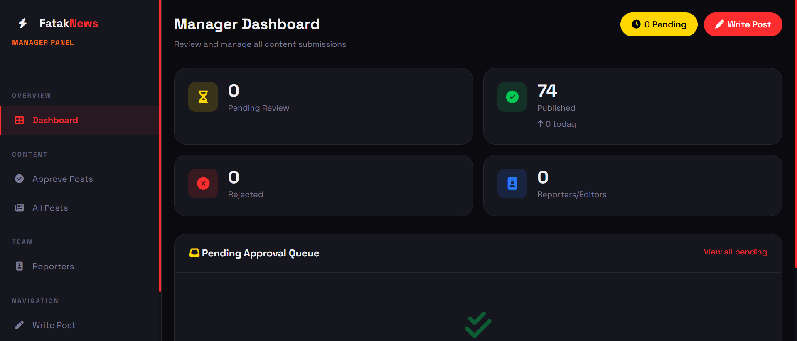 | 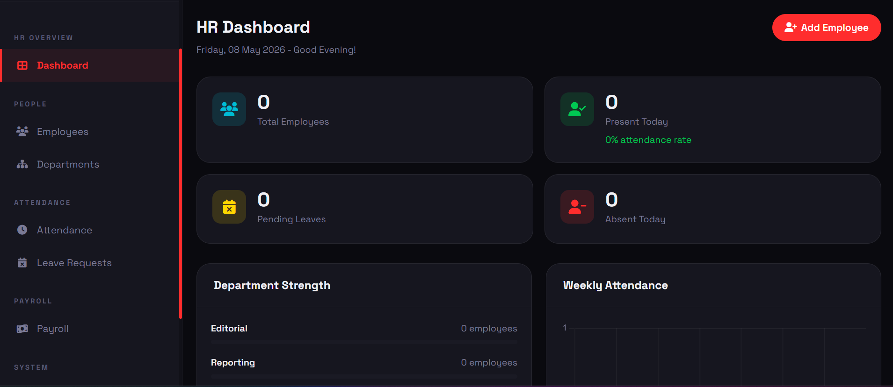 |

| Profile Menu |
| --- |
|  |

### Mobile Mode

| Home | Explore | Trending |
| --- | --- | --- |
|  | 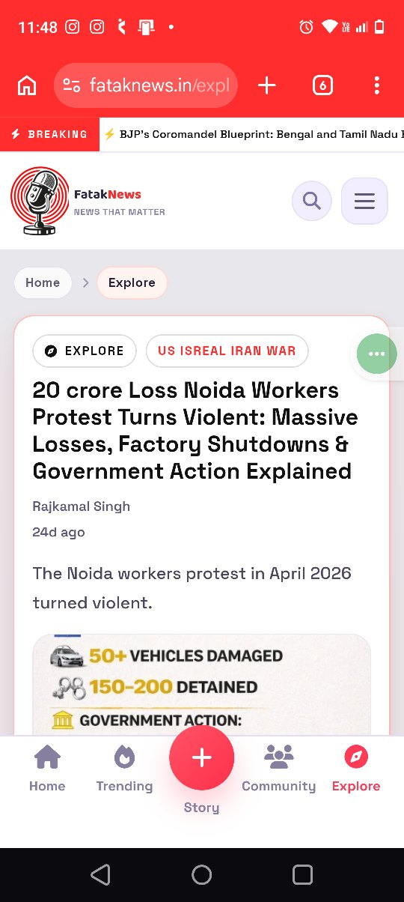 |  |

| Community | Login | Story Modal |
| --- | --- | --- |
|  |  | 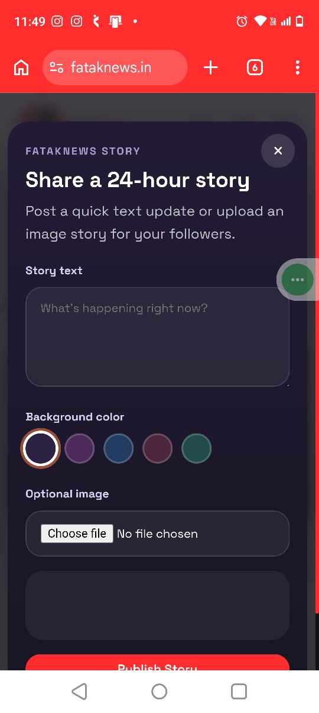 |

| Home Story | Account Menu | Admin Dashboard |
| --- | --- | --- |
|  | 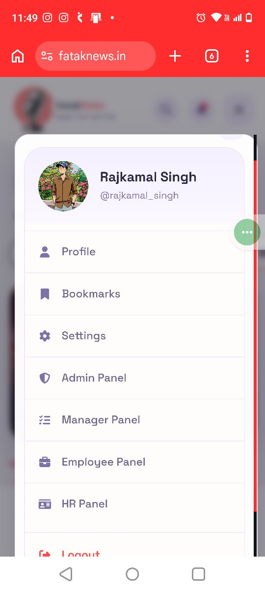 | 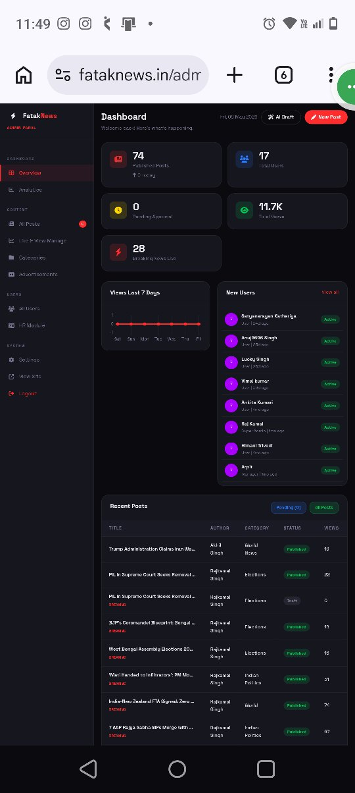 |

For local WAMP setup with the current repo path, add this Google OAuth redirect URI in Google Cloud Console:
`http://localhost/fataknews_complete_2/fataknews/auth/google/callback`

### Step 3 — File Permissions
```bash
chmod 755 public/uploads
chmod 755 public/uploads/thumbnails
chmod 755 public/uploads/avatars
chmod 755 public/uploads/news
```

### Step 4 — Apache VHost
```apache
<VirtualHost *:80>
  ServerName fataknews.in
  DocumentRoot /var/www/fataknews
  <Directory /var/www/fataknews>
    AllowOverride All
    Require all granted
  </Directory>
</VirtualHost>
```

### Step 5 — Create Super Admin
```sql
INSERT INTO users (role_id, username, email, password_hash, full_name, is_active, email_verified)
VALUES (1, 'admin', 'admin@fataknews.in', '$2y$12$...bcrypt_hash...', 'Super Admin', 1, 1);
-- Generate hash: php -r "echo password_hash('YourPassword123', PASSWORD_BCRYPT, ['cost'=>12]);"
```

---

## 🎨 Features

### Public Website (Social-Media Style)
- ⚡ Live breaking news ticker
- 🎠 Hero slider for breaking news
- 📰 Instagram-style news feed with reactions
- 🔍 Live AJAX search
- 🏷️ Category mega-menu (3 levels deep)
- 👥 Community section for user posts
- 🔔 Real-time notifications
- 🔖 Bookmarks
- ❤️ Reactions (like/love/fire/clap/angry)
- 💬 Threaded comments
- 👤 User profiles with follow system
- 🏅 Badges & levels system

### Admin Panel
- 📊 Dashboard with charts
- ✅ Post approval workflow
- 👥 User management
- 📁 Category management (nested)
- 📢 Advertisement management
- ⚙️ Site settings
- 📈 Analytics

### Manager Panel
- 📥 Pending posts queue
- ✅/❌ Approve/reject with reasons
- 👨‍💼 Reporter management

### Employee Panel
- ✍️ Rich text editor (contenteditable + execCommand)
- 📋 My posts tracker
- ⏱️ One-click attendance check-in/out
- 🌴 Leave application

### HR Panel
- 👥 Employee directory
- 🏢 Department breakdown with charts
- ✅ Leave request approval workflow
- ⏱️ Attendance tracking
- 💰 Payroll management

---

## 🔒 Security Features
- CSRF protection on all forms
- Password hashing with bcrypt (cost=12)
- PDO prepared statements (SQL injection prevention)
- Role-based access control (7 roles)
- Input sanitization with htmlspecialchars
- Session regeneration on login
- Security headers via .htaccess
- File upload validation (MIME type + size)
- Rate limiting ready (add Redis/APCu)

---

## 📱 Responsive Design
- Mobile-first CSS
- Collapsible sidebar on mobile
- Touch-friendly interactions
- Dark theme throughout
- Inspired by Instagram, Twitter/X, Quora

---

## 🌐 API Endpoints
| Method | Endpoint | Description |
|--------|----------|-------------|
| POST | `/api/auth/login` | User login |
| POST | `/api/auth/register` | User registration |
| POST | `/api/posts` | Create/update post |
| POST | `/api/posts/react` | React to post |
| POST | `/api/posts/bookmark` | Bookmark post |
| POST | `/api/comments` | Add comment |
| POST | `/api/follow` | Follow/unfollow user |
| GET  | `/api/notifications` | Get notifications |
| POST | `/api/notifications/read` | Mark all read |
| POST | `/api/admin/posts` | Admin post actions |
| POST | `/api/hr/leaves` | Leave management |
| POST | `/api/hr/attendance` | Mark attendance |

---

Made with ❤️ for FatakNews.in | © 2024
